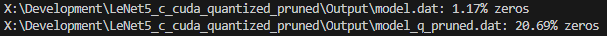

# LeNet5_c_cuda_quantized_pruned
Codebase for working with [LeNet5](https://github.com/fan-wenjie/LeNet-5) by [fan-wenjie](https://github.com/fan-wenjie). There's a file for training the model on a PC (C), testing the model on a PC (C), testing the model on a Jetson (C), and testing the model on a Jetson using cuda. The objective of this experiment is to show benefits of pruning.

Many of these steps/code have files located where I like to place them in my PC, if you place files in different places the steps/code may not work, so don't forget to update paths as needed.

## Table of Contents
- [x] [Install VS Code](#install-vs-code)
- [x] [Install useful VS Code Extensions](#install-useful-vscode-extensions)
- [x] [Open this repo in VS Code as a workspace](#open-this-repo-in-vs-code-as-a-workspace)
- [x] [Install MSYS2](#install-msys2)
- [x] [Install GCC compiler via MSYS2](#install-gcc-compiler-via-msys2)
- [x] [Add GCC compiler to your windows path](#add-gcc-compiler-to-your-windows-path)
- [x] [Check your GCC compiler version](#check-your-gcc-compiler-version)
- [x] [Check your GDB version](#check-your-gdb-version)
- [x] [Check your G++ version](#check-your-g-version)
- [x] [Select your compiler in VS Code](#select-your-compiler-in-vs-code)
- [x] [Setup VS Code so it can compile LeNet5 source code](#setup-vs-code-so-it-can-compile-lenet5-source-code)
- [x] [Running Code on PC](#running-code-on-pc)
    - [x] [Training the Model](#training-the-model)
    - [x] [Test the Model](#test-the-model)
- [x] [Running Code on the Jetson](#running-code-on-the-jetson)
    - [x] [Single-Thread Test](#single-thread-test)
    - [x] [Multi-Thread Test (cuda)](#multi-thread-test-cuda)
- [x] [Tool Versions (Windows)](#tool-versions-windows)
- [x] [Results](#results)

## Install [Visual Studio Code](https://code.visualstudio.com/download)

## Install useful VS Code extensions
- You'll want...
    - [C/C++](https://marketplace.visualstudio.com/items?itemName=ms-vscode.cpptools)
    - [C/C++ Extension Pack](https://marketplace.visualstudio.com/items?itemName=ms-vscode.cpptools-extension-pack)
- You can install these extensions within VS Code by searching for 'C++' in the Extensions view `(Ctrl+Shift+X)`.

## Open this repo in VS Code as a workspace
- This repo should land in a folder called `LeNet5_c_cuda_quantized_pruned`
- Open VS Code then click File -> Open workspace from file...
- Select the workspace file `LeNet5_c_cuda_quantized_pruned.code-workspace`
- You may have to add folder to workspace which should be the parent directory of the code-workspace file, the workspace structure should look like this:

LeNet5 \
├── .vscode  \
├── Library \
├── Output \
├── Source \
├── LeNet5_c_cuda_quantized_pruned.code-workspace \
├── README.md

## Install [MSYS2](https://www.msys2.org/)
- Installation directory should be as close as possible to `C:\`
- During installation it may take a while updating keys, at 50% progress, just let it finish, it wil eventually finish
- Version: `msys2-x86_64-20250221`

## Install GCC compiler via MSYS2
- Open a MSYS2 terminal
- Run the command `pacman -Syu`
- input `y` if prompted
- the terminal may close, open another terminal if that happens
- Run the command `pacman -S mingw-w64-ucrt-x86_64-gcc`
- input `y` if prompted
- Run the command `pacman -S --needed base-devel mingw-w64-ucrt-x86_64-toolchain`
- press `enter` to accept default config if prompted
- input `y` if prompted
- GCC is now installed

## Add GCC compiler to your windows path
- In windows, open the system properties by click the start icon and typing `edit the system environment variables`
- system properties window will open, click the button `Environment Variables...` in the bottom right of the Advanced tab
- In the section `USer variables for <user>` locate the variable `Path` and select it
- Press the `Edit` button
- Press the button `New`
- Add the following `C:\msys64\ucrt64\bin`
- Click the `OK` button until all the windows have closed

## Check your GCC compiler version
- in a terminal input `gcc --version`

## Check your GDB version
- in a terminal input `gdb --version`

## Check your G++ version
- in a terminal input `g++ --version`

## Select your compiler in VS Code
- CAUTION in the following steps, if you see "cl.exe" this is the incorrect compiler, you may have to close VS Code and reopen the project for the compiler list to update...
- Press the play button in the top-right corner of the file you want to run and select the `Run C/C++ File` button
- When you run a c/c++ file it will ask you to select the compiler, it should be the one located in the same place that you specified in your Path `C:\msys64\ucrt64\bin`
- Note: Pick the compiler that corresponds to the language you're using: c -> gcc, c++ -> g++
- In our case we're using gcc

## Setup VS Code so it can compile LeNet5 source code
- You'll need a tasks.json file located in .vscode folder, this should already exist in the repo but if you try to compile and it can't find the SDK, it means there is no tasks.json
- Your tasks.json should have arguments pointing to the header and library files of the source code (.c and .h files).
- Your tasks.json should also have arguments pointing to your source code
- more details about using VS Code this way can be found [here](https://code.visualstudio.com/docs/languages/cpp)
- If you're using this repo as the workspace (recommended) then this has already been done!

## Running Code on PC
CAUTION In VS Code, sometimes you'll open a C file and the run button is gone. No clue why this happens, but you can fix it by clicking the "split editor right" button (it's next to where the run button should be). No clue why that's a thing.

### Training the Model
- Open pc_training_q_pruned.c in VS Code
- Hit play, let it do its thing, maybe update your paths
    - This will output a `model.dat` which contains your trained weights and biases!

### Test the Model
- Open pc_jetson_test_quantized_pruned_pruned.c
- Hit play, ...
    - This loads the `model.dat` and the dataset and tests the dataset with the trained model.

## Running Code on the Jetson

### Single-Thread Test
This is the same code that runs on the PC, pc_jetson_test_quantized_pruned_pruned.c

Create a directory structured like this: \
This directory does not have to be inside the workspace (recommended).

single-thread  \
├── pc_jetson_test_quantized_pruned_pruned.c  \
├── lenet_quantized_pruned_pruned.c \
├── lenet_quantized_pruned_pruned.h \
├── model.dat \
├── t10k-images-idx3-ubyte \
├── t10k-labels-idx1-ubyte

- Just **copy** the files that you need from this repo to your single-thread folder.
- You can find...
    - `pc_jetson_test_q_pruned.c` in LeNet5_c_cuda_quantized_pruned_pruned/Source
    - `t10k-images-idx3-ubyte` and `t10k-labels-idx1-ubyte` in LeNet5_c_cuda_quantized_pruned/Library/LeNet5/LeNet-5
    - `lenet_q_pruned.c`, `lenet_quantized_pruned.h` in LeNet5_c_cuda_quantized_pruned/Source/include
    - `model.dat` in LeNet5_c_cuda_quantized_pruned/Output
- Open a terminal.
- Use `ls`/`cd` to navigate to your `single-thread` directory.
    - i.e. `> cd path/to/where/you/placed/single-thread`
- Run `gcc -o lenet5Qsinglethread pc_jetson_test_q_pruned.c lenet_q_pruned.c -lm` to generate the .exe file.
    - You will see `lenet5Qsinglethread` appear in the folder.
- Run `./lenet5Qsinglethread` and wait...
    - This loads the `model.dat` and the dataset and tests the dataset with the trained model.
    - After a while, you should see the accuracy and elapsed time appear in the terminal.
    - Mine took 150 seconds.

### Multi-Thread Test (cuda)
Create a directory structured like this: \
This directory does not have to be inside the workspace (recommended).

multi-thread  \
├── jetson_test_q_pruned.cu  \
├── model.dat \
├── t10k-images-idx3-ubyte \
├── t10k-labels-idx1-ubyte

- Just **copy** the files that you need from this repo to your single-thread folder.
- You can find...
    - `jetson_test_q_pruned.cu` in LeNet5_c_cuda_quantized_pruned/Source
    - `model.dat` in LeNet5_c_cuda_quantized_pruned/Output
    - `t10k-images-idx3-ubyte` and `t10k-labels-idx1-ubyte` in LeNet5_c_cuda_quantized_pruned/Library/LeNet5/LeNet-5
- Open a terminal.
- Use `ls`/`cd` to navigate to your `multi-thread` directory.
    - i.e. `> cd path/to/where/you/placed/multi-thread`
- Run `nvcc -o lenet5Qmultithread jetson_test_quantized.cu` to generate the .exe file.
    - You will see `lenet5Qmultithread` appear in the folder.
- Run `./lenet5Qmultithread` and wait...
    - This loads the `model.dat` and the dataset and tests the dataset with the trained model.
    - After a while, you should see the accuracy and elapsed time appear in the terminal.
    - Mine took 0.15 seconds.
    - Yes, zero point!

### Results

The main benefit of pruning is the model complexity is decreased by removing "meaningless" weights and replacing them with zeroes. We used a python script, located in /Debug to check how many zeroes were present compared to the regular model. We selected a pruning rate of 0.20 during training

#### Pruned Model
| Model | Accuracy | Time |
|:-------------:|:-------------:|:-------------:|
| PC Training | 9454/10000 | 10m 48s |
| PC Test | ... | 17s |
| Jetson Single-thread | ... | 2m 30s |
| Jetson Multi-thread | ... | 0.15s |

#### Quantized Model
| Model | Accuracy | Time |
|:-------------:|:-------------:|:-------------:|
| PC Training | 9547/10000 | 10m 20s |
| PC Test | ... | 17s |
| Jetson Single-thread | ... | 2m 30s |
| Jetson Multi-thread | ... | 0.15s |

#### Non-quantized Model
| Model | Accuracy | Time |
|:-------------:|:-------------:|:-------------:|
| PC Training | 9718/10000 | 5m 47s |
| PC Test | ... | 17.61s |
| Jetson Single-thread | ... | 2m 26s |
| Jetson Multi-thread | ... | 0.1s |

### Easily Formatting this Readme file (when viewing in VS Code)

You can see a preview of how this readme will look when pushed to GitHub by opening the Readme.md file in VS Code then pressing the shortcut `ctrl + shift + v`.

For a markdown formatting cheatsheet visit this page for [standard syntax](https://github.com/adam-p/markdown-here/wiki/markdown-cheatsheet "Markdown Cheat-Sheet") and [extended syntax](https://www.markdownguide.org/extended-syntax/#definition-lists).

### Tool Versions (Windows)

| Tool | Version |
|:-------------:|:-------------:|
| MSYS2 | msys2-x86_64-20250221 |
| gcc | 14.2.0 |
| gdb | 16.2 |
| g++ | 14.2.0 |